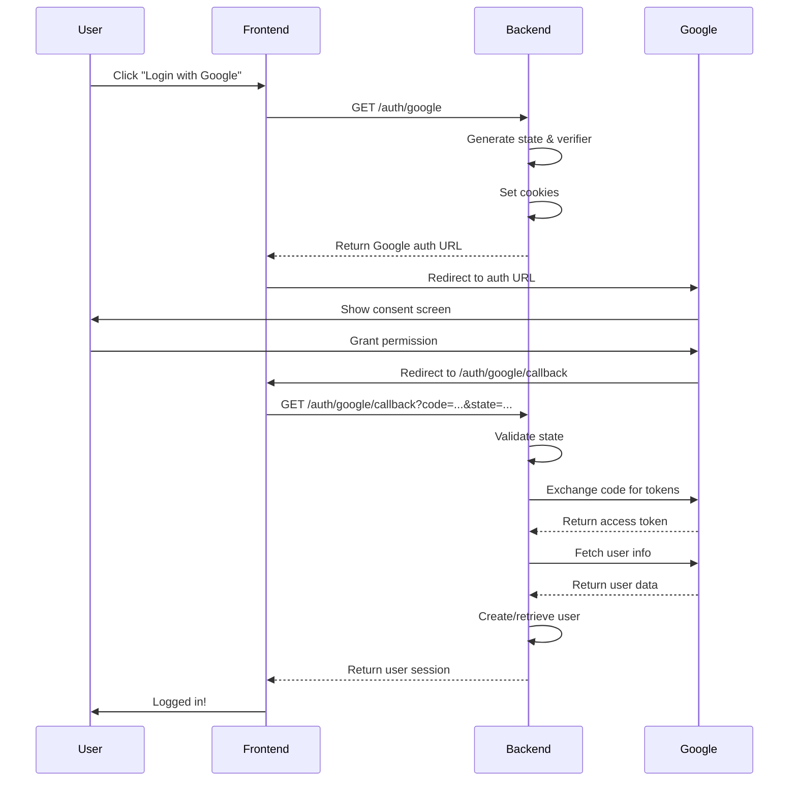

# Auth Feature

Google OAuth 2.0 authentication implementation using Arctic and the Result Pattern.

## Overview

This feature provides secure Google OAuth authentication with proper state management and PKCE flow. Users can authenticate using their Google accounts, and the system automatically creates or retrieves user records.

## Architecture

Following the feature-based structure defined in `AGENTS.md`:

```
auth/
├── auth.controller.ts      # HTTP response mapping
├── auth.service.ts         # Business logic & OAuth flow
├── auth.routes.ts          # API routes & cookie handling
├── auth.types.ts           # TypeScript types & schemas
└── auth.service.test.ts    # Unit tests
```

## API Endpoints

### `GET /auth/google`

Initiates the Google OAuth flow.

**Response:**

```json
{
  "data": {
    "url": "https://accounts.google.com/o/oauth2/v2/auth?...",
    "state": "random_state_string",
    "codeVerifier": "random_verifier_string"
  }
}
```

**Side Effects:**

- Sets `oauth_state` cookie (HTTPOnly, SameSite=Lax, 10min expiry)
- Sets `oauth_code_verifier` cookie (HTTPOnly, SameSite=Lax, 10min expiry)

**Usage:**

1. Frontend calls this endpoint
2. Redirect user to the returned URL
3. User authenticates with Google
4. Google redirects to callback endpoint

---

### `GET /auth/google/callback`

Handles the OAuth callback from Google.

**Query Parameters:**

- `code` (string, required) - Authorization code from Google
- `state` (string, required) - State parameter for CSRF protection

**Response (Success):**

```json
{
  "data": {
    "message": "Authentication successful",
    "user": {
      "userId": "uuid",
      "email": "user@example.com",
      "name": "User Name"
    }
  }
}
```

**Response (Error):**

```json
{
  "error": "Invalid state parameter",
  "code": "VALIDATION_ERROR"
}
```

**Side Effects:**

- Removes `oauth_state` cookie
- Removes `oauth_code_verifier` cookie
- Creates user if doesn't exist
- Retrieves existing user if email already registered

---

## Configuration

Required environment variables:

```bash
GOOGLE_CLIENT_ID=your-client-id.apps.googleusercontent.com
GOOGLE_CLIENT_SECRET=your-client-secret
GOOGLE_REDIRECT_URI=http://localhost:3000/auth/google/callback
```

### Getting Google OAuth Credentials

1. Visit [Google Cloud Console](https://console.cloud.google.com/)
2. Create or select a project
3. Enable Google+ API (or People API)
4. Create OAuth 2.0 credentials:
   - Type: Web application
   - Authorized redirect URIs:
     - Development: `http://localhost:3000/auth/google/callback`
     - Production: `https://your-domain.com/auth/google/callback`
5. Copy Client ID and Secret to `.env`

---

## Security Features

1. **CSRF Protection**: State parameter validates callback authenticity
2. **PKCE Flow**: Code verifier prevents authorization code interception
3. **HTTPOnly Cookies**: Prevents XSS attacks on state/verifier
4. **SameSite Cookies**: Prevents CSRF attacks
5. **Email Verification**: Only verified Google emails are accepted
6. **Secure in Production**: Cookies use `Secure` flag in production

---

## User Flow



---

## Error Handling

All errors follow the Result Pattern (neverthrow):

```typescript
// Service returns Result<AuthSession, DomainError>
const result = await authService.validateCallback(...);

result.match(
  (session) => // Success case,
  (error) => // Error case
);
```

**Common Errors:**

| Error                                | Cause                         | HTTP Status |
| ------------------------------------ | ----------------------------- | ----------- |
| `Missing Google OAuth configuration` | Environment variables not set | 500         |
| `Invalid state parameter`            | CSRF attack or expired state  | 400         |
| `Email not verified by Google`       | Google email not verified     | 400         |
| `Failed to fetch user info`          | Google API error              | 500         |

---

## Testing

The auth service includes unit tests covering:

- ✅ Authorization URL generation
- ✅ Configuration validation
- ✅ Error handling for missing credentials

Run tests:

```bash
bun test src/features/auth/auth.service.test.ts
```

**Note:** Full OAuth flow testing requires integration tests with mocked Google API responses.

---

## Integration with User System

When a user authenticates via Google:

1. Backend fetches user info from Google
2. Searches for existing user by email
3. If found: Returns existing user session
4. If not found: Creates new user with:
   - `name`: From Google profile
   - `email`: From Google profile (verified)
   - `cellphone`: Empty string (can be updated later)

The user repository's `findByEmail` method is used for this lookup.

---

## Production Checklist

- [ ] Set `GOOGLE_CLIENT_ID` in production environment
- [ ] Set `GOOGLE_CLIENT_SECRET` in production environment
- [ ] Set `GOOGLE_REDIRECT_URI` to production callback URL
- [ ] Add production callback URL to Google OAuth allowed redirects
- [ ] Set `NODE_ENV=production` for secure cookies
- [ ] Use HTTPS for all OAuth endpoints
- [ ] Implement session management after authentication
- [ ] Add rate limiting to auth endpoints
- [ ] Set up logging/monitoring for auth failures

---

## Future Enhancements

Potential improvements:

- [ ] JWT token generation for stateless sessions
- [ ] Refresh token handling
- [ ] Multi-provider support (GitHub, Facebook, etc.)
- [ ] Account linking (merge OAuth with email/password)
- [ ] Session management & logout
- [ ] Remember me functionality
- [ ] OAuth scopes configuration
